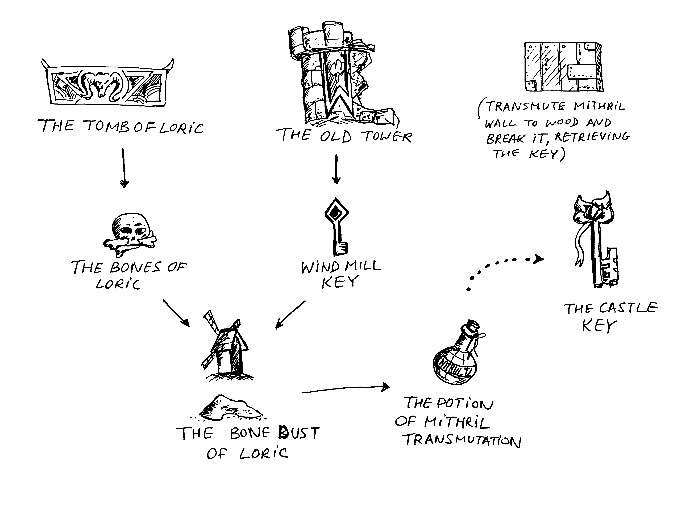

# Examples

## FutureJection

Mini presentation about eventual providers. Slides were initially created to be presented for meetup 
at Symphony.com (Palo Alto, CA US)

* [FutureJection slides](FutureJection.pdf)

* [Barbican demo](barbican/)

Inpired by Hexen II (c) game content. There's `Barbican` class with `main`
method which demostrates the usage of this Guice add-on.

